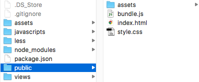

# A Modern Web Development Workflow
#### with ES2015 modules, CSS preprocessing and HTML templating
by [Kyle Phillips](http://haptic-data.com)


I had a friend recently start his first web project in several years. He has been busy building great Android apps but was very confused when trying to understand how we build websites these days. He asked if I could help him get set up and explain to him why all of this complexity is necessary. I provided him with [my template that I use](http://github.com/hapticdata/template-browserify) to start most of my _static_ projects. When he asked me to break it down into what all it does and how all of this can be possibly necessary, that is when I realized its complexity and decided to write this post to break it down. **The purpose of this post is to explain to a developer what it means to be working with a modern, javsascript-centric web workflow**.

In a modern javascript workflow all of your assets are going to go through some sort of a build process: 

1. You will write templates to generate html, 
2. you will write [CommonJS](http://wiki.commonjs.org/wiki/Modules/1.1) modules for javascript in ES2015 syntax and 
3. you will use a CSS preprocessor such as [Less](http://lesscss.org) for your stylesheets. 

For this reason it is best to create a folder that contains only your resulting files that you will never edit directly and typically not commit into version control. The template I've provided will create a new folder called `public/` for these generated assets. This folder name is easily changed but the decision for "public" was based on the convention of [Express.js](http://expressjs.com).



So lets break down what this template does, I don't use [gulp](http://gulpjs.com/) or [grunt](http://gruntjs.com), I keep my scripts in my [package.json](https://docs.npmjs.com/files/package.json), lets dissect those:

### `npm run build`
##### uses [browserify](http://browserify.org/), [babelify](http://babeljs.io) and [babel-preset-es2015](http://babeljs.io/docs/plugins/preset-es2015/)
This command will use [browserify](https://github.com/substack/node-browserify) to take all of my javascript files and build them into a single javascript file, external dependencies and my own project files. Browserify has the additional concept of [transforms](https://github.com/substack/module-deps#transforms) and I use [Babelify](https://github.com/babel/babelify) so that I can write [ES2015](https://babeljs.io/docs/learn-es2015/) modules but still support older browsers. As of Babel v6.0 its presets are separated from its core, I typically use the `babel-preset-es2015`, those working with [React.js](http://reactjs.org) will want to use `babel-preset-react`. These transforms are setup [here in my package.json](https://github.com/hapticdata/template-browserify/blob/master/template/package.json#L6) and includes important features such as [source maps](https://www.html5rocks.com/en/tutorials/developertools/sourcemaps/).

### `npm run copy-assets`
##### uses [cpx](https://www.npmjs.com/package/cpx)
Because we want our `public/` directory to only include files that can be safely deleted and re-generated at any time we will use [cpx](http://***) to take every file in `assets/` and copy it over to `public/assets/` in order to be served. Similarly, the  `watch-assets` process will do the same but remain watching your `assets/` directory for any changes.


### `npm run budo`
##### uses [budo](https://www.npmjs.com/package/budo), [garnish](https://www.npmjs.com/package/garnish)
Budo is a great tool for prototyping and built on top of Browserify. Budo will start a local file server to serve the contents of your `public/` directory, it will also watch your `javascripts/` directory for any changes and produce an incremental (fast) build every time files have changed. As a bonus, the `--live` flag provides [LiveReload](http://***) functionality to your project.


### `npm run pug`
##### uses [pug](https://www.npmjs.com/package/pug)
Pug is a great template language, _previously known as Jade_ that will be used for generating the sites HTML. There are a lot of different template languages out there and Pug isn't for everyone, but I really appreciate its lean syntax.


### `npm run less`
##### uses [less](http://lesscss.org)
This process will generate your css files from `less/` to `public/styles.css`. [Less](http://lesscss.org) and [Stylus](http://***) are my preferred options for CSS preprocessing. [SASS](http://sass-lang.com) is great but for the sake of installation, I prefer to keep everything on [npm](http://npmjs.org) and not introduce another installation step with [Ruby](http://ruby-lang.org).


### `npm run watch`
#### uses [concurrently](https://www.npmjs.com/package/concurrently), [budo](https://www.npmjs.com/package/budo), [pug](https://www.npmjs.com/package/pug), [less](http://lesscss.org), [cpx](https://www.npmjs.com/package/cpx)
This is the only process you need to run while you are actively developing. The package [concurrently](https://github.com/kimmobrunfeldt/concurrently) allows multiple processes to run simultaneously in a way that works cross-platform _(i.e. works on Windows also)_. The process will start up a file-server and javascript-watcher with [Budo](https://github.com/mattdesl/budo), it will start up `less-watch` to  watch your stylesheets, `watch-abets` to watch your `assets/` folder, and `pug-watch` to watch your template files.


Here is the entirety of all of these builds as they are implemented in my package.json:

```json
  "browserify": {
    "transform": [
      [
        "babelify",
        {
          "presets": [
            "es2015"
          ]
        }
      ]
    ]
  },
  "scripts": {
    "build": "browserify javascripts/index.js -o public/bundle.js",
    "copy-assets": "cpx \"assets/**/*\" \"public/assets/\" --clean",
    "watch-assets": "npm run copy-assets -- --watch",
    "budo": "budo javascripts/index.js:bundle.js --port=3000 --live -v --dir=public | garnish",
    "pug": "pug views/pages/ --out public/ --pretty",
    "pug-watch": "pug --out public/ --pretty --watch views/pages/",
    "less-watch": "autoless less/ public/",
    "less": "lessc less/style.less public/style.css",
    "watch": "npm run pug && npm run less && concurrent \"npm run watch-assets\" \"npm run pug-watch\" \"npm run budo\" \"npm run less-watch\""
  },
```


## Starting your project for the first time

Now that you have the template and you understand all of the tasks it is taking care of, here is the process to start working on your site:

1. copy the template to a new directory
2. run `npm install`
3. run `npm run watch`
4. open your browser to [http://localhost:3000](http://localhost:3000)

## Deploying your project

When it comes time to put your site up on a server:

1. run `npm run build` to create your production-ready bundled javascript
2. copy the contents of `public/` to your server


## Taking it further
At this point, you have everything you need for an efficient modern workflow that works on Mac, Linux and Windows and requires no global dependencies other than [Node.js](http://nodejs.org). There is of course always more you can add:

### Unit Tests with [tape](https://github.com/substack/tape)
Tape is great for unit-tests and it makes it very easy to write tests that can run headless in Node.js as well as in browser. If, for example, you have a `test.js` file, you can run it headless with `node test.js` or if it requires dom elements or you just want to see it in browser you can run `budo test.js`and open your console.


### GLSL Shader Compilation with [glslify](https://github.com/stackgl/glslify)
This isn't for everyone, but personally I do a lot of [WebGL](https://www.chromeexperiments.com/webgl) work and write a lot of GLSL Shaders. Using [glslify](https://github.com/stackgl/glslify) is the best solution I've found and provides a `require`-like system for GLSL code; a lot of which is available through NPM.


### Template Variables for [pug](http://pugjs.org)
I typically will have a file such as `locals.json` that sits in my projects root and contains template variables. A variables file like this is a great way to do localization or to share data between both templates and javascript. If you want to do this, create the file and simply change `pug` and `pug-watch` to include `-O locals.json` in their arguments.

### Client-side Templates with [pugify](https://github.com/sidorares/pugify)
Your same templates you are serving can also be bundled into your javascript file for [client-side templating](https://www.smashingmagazine.com/2012/12/client-side-templating/).


### Starting Projects Quickly with [Sketchplate](http://haptic-data.com/sketchplate)
This is my own open-source project, which currently only supports Mac. It is aimed towards starting projects very quickly and promotes maintaining your own templates for re-use. With [Sketchplate](http://github.com/hapticdata/sketchplate) you can get up and running in seconds. Just install the `sketchplate` command globally with `npm install -g sketchplate` then to install any template its as simple as `sketchplate template install <github_user>/<repo>`.

If this article was _TL;DR_ you can get a new project up and running with this template in the following steps:

##### Do once:
1. npm install -g sketchplate
2. run `sketchplate template install hapticdata/template-browserify browserify`

#### Do each time you start a project:
1. run  `sketchplate new ./<project-folder> --template browserify`
2. `cd` into directory and run `npm install`
3. run `npm run watch`

And you are ready to start coding with a modern web development workflow.